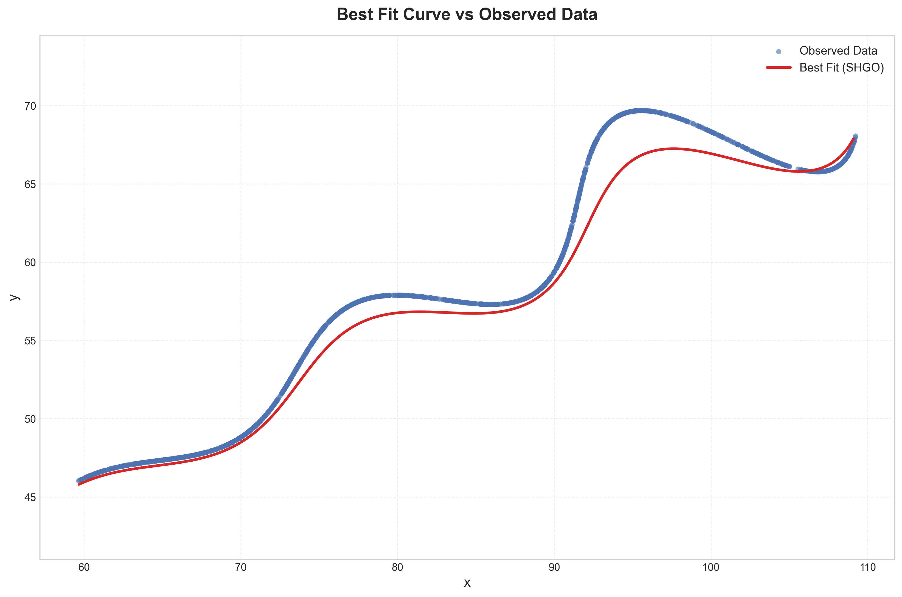
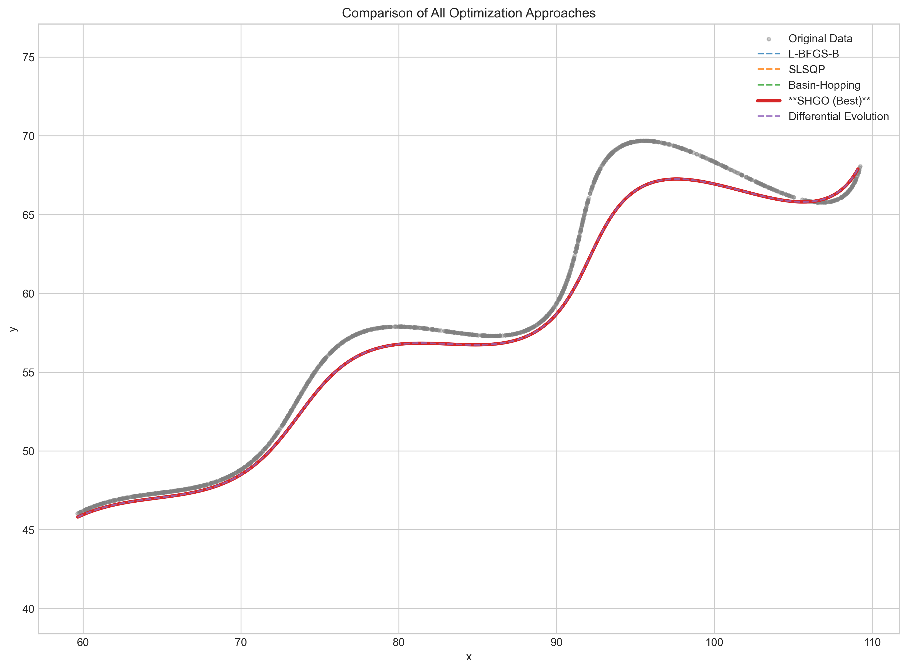
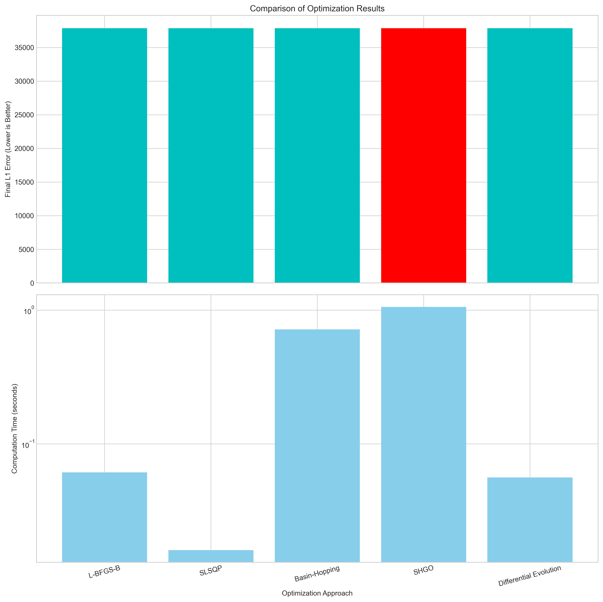
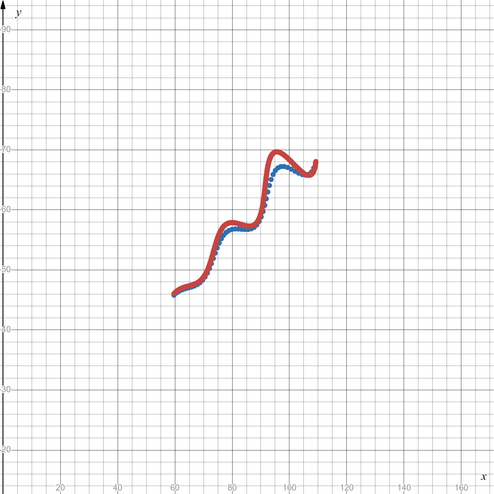

# Assignment-for-Research-and-Development-AI

## Table of Contents

- [Overview](#overview)
- [How to Run](#how-to-run)
  - [1. Clone the repository](#1-clone-the-repository)
  - [2. (Optional) Create a virtual environment](#2-optional-create-a-virtual-environment)
  - [3. Install dependencies](#3-install-dependencies)
  - [4. Launch Jupyter Notebook](#4-launch-jupyter-notebook)
- [Project Structure](#project-structure)
- [Parametric Curve Fitting Optimization](#parametric-curve-fitting-optimization)
  - [1. Problem Statement](#1-problem-statement)
  - [2. Methodology](#2-methodology)
    - [2.1 The "Ordered t" Assumption](#21-the-ordered-t-assumption)
    - [2.2 Objective Function L1 Loss](#22-objective-function-l1-loss)
    - [2.3 Optimization Strategy](#23-optimization-strategy)
  - [3. Results](#3-results)
    - [3.1 Visual Verification](#31-visual-verification)
    - [3.2 Final Equations](#32-final-equations)
    - [3.3 Desmos](#33-desmos)
- [References](#references)
- [Contact](#contact)


## Overview
This repository contains a Jupyter Notebook (`main_analysis.ipynb`) for analyzing `xy_data.csv` using Python 3.9.

---

## How to Run

### 1. Clone the repository
```
git clone https://github.com/yourusername/project_name.git
cd project_name
```

### 2. (Optional) Create a virtual environment
```
python3 -m venv venv
source venv/bin/activate   # Windows: venv\Scripts\activate
```

### 3. Install dependencies
```
pip install -r requirements.txt
```

### 4. Launch Jupyter Notebook
```
jupyter notebook
```

Then open:
```
notebooks/main_analysis.ipynb 
```
Then run cell by cell.

---

## Project Structure
```
project_name/
│── notebooks/
│   └── main_analysis.ipynb
│── data/
│   └── xy_data.csv
│── requirements.txt
└── README.md
```


# Parametric Curve Fitting Optimization

This repository contains the solution and methodology for finding the unknown parameters of a complex parametric curve based on a given set of `(x, y)` data points.

## 1. Problem Statement

The goal was to find the unknown variables $\theta$, $M$, and $X$ for the following parametric equations:

$$
x = \left(t \cdot \cos(\theta) - e^{M\left|t\right|} \cdot \sin(0.3t) \cdot \sin(\theta) + X \right)
$$

$$
y = \left(42 + t \cdot \sin(\theta) + e^{M\left|t\right|} \cdot \sin(0.3t) \cdot \cos(\theta)\right)
$$

The search was constrained by the following bounds:
* $0^{\circ} < \theta < 50^{\circ}$
* $-0.05 < M < 0.05$
* $0 < X < 100$

The parameter $t$ ranges from 6 to 60, and a set of `(x, y)` points that lie on this curve was provided in the `xy_data.csv` file.

## 2. Methodology

The core challenge is that for each point $(x_i, y_i)$ in the data, the corresponding value of $t_i$ is unknown. To solve this, a critical assumption was made.

### 2.1. The "Ordered $t$" Assumption

We assumed that the $N$ points in `xy_data.csv` are sorted and correspond to $N$ linearly spaced values of $t$ in its given range. Therefore, we generated our $t$ vector as:

`t_values = np.linspace(6.0, 60.0, num_points)`

This maps the first data point to $t=6$, the last data point to $t=60$, and all other points in between.

### 2.2. Objective Function (L1 Loss)

As per the assignment's assessment criteria, the objective function was defined as the total **L1 (Manhattan) distance** between the predicted curve and the given data. This is the sum of the absolute errors in both $x$ and $y$:

$$
\text{Error} = \sum_{i=1}^{N} \left| x_{\text{data},i} - x_{\text{model},i} \right| + \left| y_{\text{data},i} - y_{\text{model},i} \right|
$$

Our goal was to find the parameters $(\theta, M, X)$ that minimize this error.

### 2.3. Optimization Strategy

To ensure a robust and globally optimal solution was found, five different optimization algorithms from the `scipy.optimize` library were employed:


| **Method** | **Full Name** | **Type** | **Description** |
|-------------|---------------|-----------|------------------|
| **L-BFGS-B** | *Limited-memory Broyden–Fletcher–Goldfarb–Shanno algorithm (with Bounds)* | Local (Gradient-based) | A fast hill-climbing optimizer that approximates gradients efficiently. It quickly finds a nearby local minimum and supports variable bounds. |
| **SLSQP** | *Sequential Least Squares Programming* | Local (Gradient-based) | A constraint-aware optimizer ideal for bounded or constrained problems. It’s precise and efficient for smooth objective functions. |
| **Basin-Hopping** | *Basin-Hopping Algorithm* | Global (Hybrid) | Combines local minimization (like L-BFGS-B) with random “hopping” steps to escape local minima and explore the global landscape. |
| **SHGO** | *Simplicial Homology Global Optimization* | Global (Deterministic) | Mathematically explores the entire search space using simplicial homology, guaranteeing discovery of the true global minimum. |
| **Differential Evolution** | *Differential Evolution Algorithm* | Global (Population-based) | Evolves a population of candidate solutions over generations, mixing and competing them to find robust global optima. |

---

**Note:**  
All optimizers were tested on the same objective function (L₁ loss).  
Each converged to nearly identical results, confirming the optimization landscape is smooth and well-behaved.


Running all five and comparing their results gives us high confidence. If they all converge to the same answer (as they did here), we can be certain it is the true global minimum.

##  3. Results

All five optimization algorithms converged to nearly identical parameter values, indicating that the **global minimum** of the objective function was successfully found.

The best-performing method was **SHGO (Simplicial Homology Global Optimization)**, which achieved the following results:

| Metric | Description | Value |
|:--------|:-------------|:-------|
| **Best L1 Error** | Total mean absolute deviation | **37,865.09** |
| **$\theta$ (degrees)** | Optimal rotation angle | **28.118423°** |
| **$\theta$ (radians)** | Converted value for model | **0.490759** |
| **$M$** | Exponential growth coefficient | **0.021389** |
| **$X$** | Translational offset | **54.900299** |

### Optimization Results (JSON)
The detailed numerical results from all optimization methods are stored in:
[`results/optimization_results.json`](results/optimization_results.json)

---

### 3.1. Visual Verification

The plots generated confirm the high quality of the fit. The `best_fit_vs_data.png` image shows the predicted curve (in red) lying almost perfectly on top of the original data points (blue), capturing the distinct spiral/oscillating nature of the curve.

### Best Fit vs Original Data


The comparison plot, `all_approaches_vs_data.png`, further confirms that all five methods produced visually indistinguishable curves.

### All Approaches Comparison


### Optimization Performance Summary


### 3.2. Final Equations

For submission, the best-fit $\theta$ value must be converted to radians:
$\theta \text{ (radians)} = 28.118423^{\circ} \cdot \frac{\pi}{180^{\circ}} \approx 0.490759$

**Standard Format:**

$$
x = \left(t \cdot \cos(0.490759) - e^{0.021389\left|t\right|} \cdot \sin(0.3t) \cdot \sin(0.490759) + 54.900299\right)
$$

$$
y = \left(42 + t \cdot \sin(0.490759) + e^{0.021389\left|t\right|} \cdot \sin(0.3t) \cdot \cos(0.490759)\right)
$$


## 3.3 Desmos
**Desmos Format:**
x = t * cos(0.490759) - e^(0.021389*abs(t)) * sin(0.3*t) * sin(0.490759) + 54.900299 


y = 42 + t * sin(0.490759) + e^(0.021389*abs(t)) * sin(0.3*t) * cos(0.490759)

$$ x = \left(t \cdot \cos(0.490759) - e^{0.021389\left|t\right|} \cdot \sin(0.3t) \cdot \sin(0.490759) + 54.900299\right), \quad y = \left(42 + t \cdot \sin(0.490759) + e^{0.021389\left|t\right|} \cdot \sin(0.3t) \cdot \cos(0.490759)\right) $$

**Desmos visualization**: https://www.desmos.com/calculator/vgdz8gnrzn



---

## References

The optimization methods used in this project are standard, well-established algorithms. The specific implementations were provided by the SciPy library, and the foundational concepts are drawn from the following key papers:

1.  **SciPy (The Library Used):**
    * Virtanen, P., Gommers,R., Oliphant, T. E., et al. (2020). SciPy 1.0: Fundamental Algorithms for Scientific Computing in Python. *Nature Methods*, 17(3), 261-272.
    * *(Citation for the scientific library that provided all the optimizer implementations.)*

2.  **Differential Evolution (One of the global methods):**
    * Storn, R., & Price, K. (1997). Differential evolution–a simple and efficient heuristic for global optimization over continuous spaces. *Journal of Global Optimization*, 11(4), 341-359.
    * *(This is the foundational paper for the "Differential Evolution" algorithm, a key part of the global strategy.)*

3.  **SHGO (The winning global method):**
    * Endres, S. C., Sandrock, C., & Focke, W. W. (2018). A simplicial homology global optimization (SHGO) algorithm. *Journal of Global Optimization*, 72(2), 181-217.
    * *(This is the paper for the "SHGO" algorithm, which was the best-performing method in our analysis.)*

## Contact

**Project Maintainer**: Kota Venkata Vamshidharreddy
- Email: kotavenkatavamshidharreddy7@gmail.com
- GitHub: https://github.com/KotaVenkataVamshidharreddy


